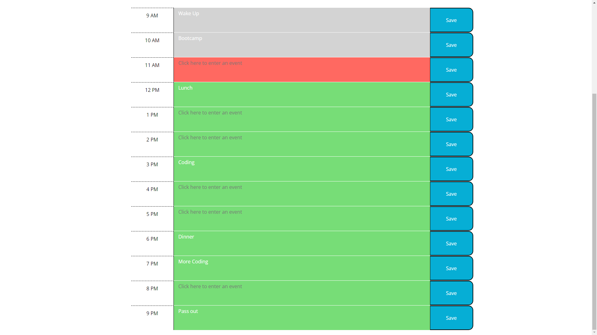

# Work Day Scheduler
> By Richard Zhang

## Description

- The motivation behind this project was to use some of the APIs that we've been introduced to such as Bootstrap, JQuery, and Moment.js to create an application.
- I built this project to enhance my understanding of how third-party APIs can speed-up and enhance the coding process. I also used this project to further my ability when it comes to functions, logic, and how JavaScript interacts with a webpage.
- This day planner can be used to store events in time-blocks, and will dynamically update the date, time, and the color-coding of the time-blocks. It can be further modified to include additional time-blocks by adding additional times to the array in the JavaScript file. It's also a demonstration of how third-party APIs can improve the functionality of a page.
- I learned through this project that the use of third-party APIs greatly enhances and simplifies the process of creating a webpage/application. Third-party APIs are numerous and being able to understand how they can be integrated into the development process helps to reduce the workload of the programmer. They are a welcome addition to the tools at our disposal when it comes to programming. 
- I think my application does well in satisfying the criteria presented. It also adds a small bit of functionality not indicated in the brief. However, I recognize that some of the functions that I created could be more efficient, and I will work toward improving in that regard.

##  Link and Screenshots

> [Link to the live application](https://richardzhang01.github.io/work-day-scheduler/)

